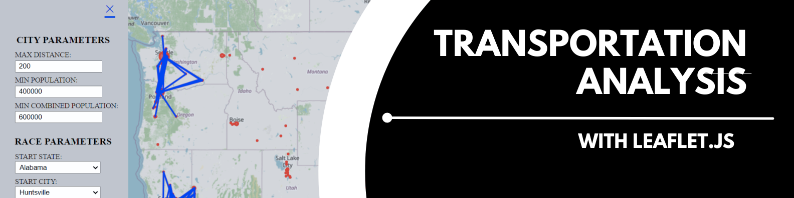
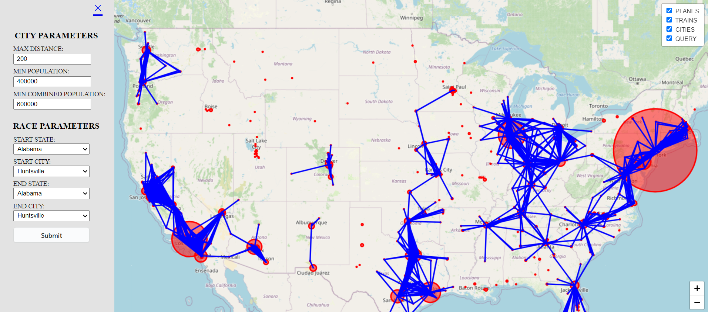

# leaflet-transportation

Author:  Erin James Wills, ejw.data@gmail.com  

  
<cite>Photo by Erin Wills</cite>  

 

## Overview  
This repository explores how population centers could influence modes of transportation.  The main question being considered is where should high speed rail be located.  Since the United Staes is very large and has low population density throughout the country, designing a practical rail system is difficult.  To analyze the problem, I selected census population data of approximately the largest 800 metropolitan areas in the United States.  I also accessed latitude and longitude data for each city by using the geocode api from Apify.  

**`Future Work`**:  Additional features like rotating icons that align with path direction and adjusting the boundary box automatically might be included.  I am also interested in adding the paths of existing transportation.   

   

## Github Pages  

Not deployed.  Runs on Flask.

 

## Technologies  
*  Python 
*  SQLite  
*  HTML/CSS/JS
*  Leaflet.js

 

## Data Source  

US Census 

 

## Setup and Installation  
1. Clone the repo to your local machine
1. Open repo folder in a terminal 
1. Run the app.py file - `python app.py`

 

## Example

<figure>

  
<figcaption>Fig.1 - Main page with the expanded sidebar visible.</figcaption>
</figure>

**References:**  
https://github.com/ewoken/Leaflet.MovingMarker